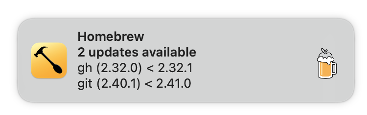

[](https://github.com/obecker/brew-auto-update-spoon/releases)

# BrewAutoUpdate.spoon
[Hammerspoon](https://www.hammerspoon.org) plugin (a.k.a. [Spoon](https://www.hammerspoon.org/go/#spoonsintro)) 
for running `brew update` automatically.

The plugin executes `brew update` at Hammerspoon's startup and then repeatedly every 8 hours (or some other defined interval).
If there are outdated packages (determined by executing `brew outdated`) it will display a notification with a button
to run `brew upgrade` in a Terminal.



In case there are too many outdated packages that cannot be fully displayed within the limited space of the 
notification's contents area, then clicking this contents area will toggle an alert with the full information.

## Installation

_Prerequisite_: you have [Hammerspoon](https://www.hammerspoon.org) installed.

Download the latest **BrewAutoUpdate.spoon.zip** file from the [Releases](https://github.com/obecker/brew-auto-update-spoon/releases) 
page and double-click the extracted `BrewAutoUpdate.spoon` folder. 
Hammerspoon should automatically move it into your `$HOME/.hammerspoon/Spoons/` folder.

Add this line to your `$HOME/.hammerspoon/init.lua` file:
```lua
hs.loadSpoon("BrewAutoUpdate"):start()
```

The plugin will auto-detect your `brew` binary and uses by default an update interval of 8 hours and a duration of 
5 seconds for displaying the additional information alert.
You may overwrite these settings with
```lua
local brewAutoUpdate = hs.loadSpoon("BrewAutoUpdate")
brewAutoUpdate.brewBinary = "/path/to/your/brew"
brewAutoUpdate.updateInterval = "6h" -- check for updates every 6 hours
brewAutoUpdate.alertSeconds = 3 -- close the info alert after 3 seconds
brewAutoUpdate:start()
```
